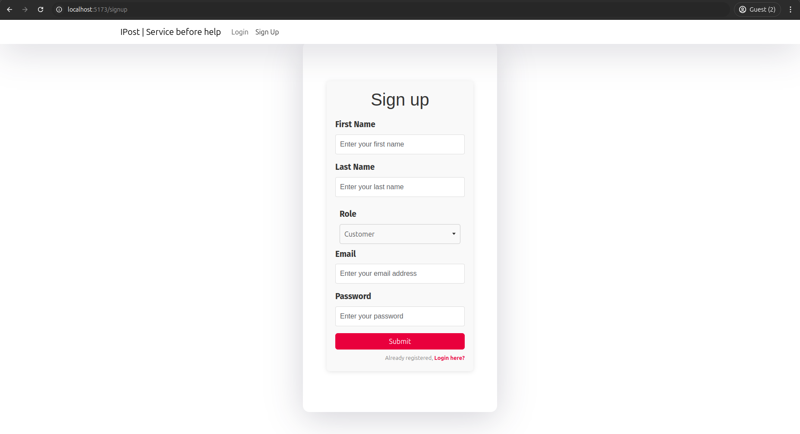

# Optimizing Last-Mile Delivery with Custom Time Slots

## About

India Post, the largest mail delivery network in India, currently operates with a fixed delivery window (10 AM to 5 PM) that often doesn't align with recipients' availability. This results in a high rate of failed deliveries, wasted resources, and customer dissatisfaction.

This project proposes a flexible solution for last-mile delivery optimization. By allowing senders to choose preferred delivery time slots during consignment booking and enabling recipients to modify their slots via a user-friendly web interface, the system seeks to improve delivery efficiency, reduce failed attempts, and enhance customer satisfaction.

The application is a full-stack solution built using **React** for the frontend, **Node.js** and **Express** for the backend, and **MongoDB** for data storage. The focus is on providing a responsive, intuitive platform that allows for seamless time-slot selection and modification, ensuring deliveries are made at convenient times for recipients.

---

## Features

- **Custom Time Slot Selection**: Senders can choose their preferred delivery time slots during consignment booking.
- **Recipient Slot Modification**: Recipients can modify their delivery time slots through a user-friendly web interface up until the day of delivery.
- **Full-Stack Application**: Built with **React** for the frontend, **Node.js** and **Express** for the backend, and **MongoDB** for managing data.
- **Optimized Delivery Scheduling**: Delivery slots are managed and optimized based on sender and recipient preferences to minimize delivery failures.
- **Responsive Web Interface**: Intuitive, mobile-friendly UI that allows users to easily select and modify their preferred delivery slots.

---

## Requirements

- **Frontend**: React.js for building a dynamic and responsive user interface.
- **Backend**: Node.js and Express.js to handle the server-side application and API logic.
- **Database**: MongoDB to store consignment, user data, and delivery slot information.
- **Development Tools**:
  - Node.js (LTS version recommended)
  - npm or yarn for package management
  - MongoDB (local setup or hosted on MongoDB Atlas)

---

## Problem Definition

India Post's fixed delivery window (10 AM to 5 PM) is often incompatible with recipients' availability, leading to failed delivery attempts and wasted resources. Recipients are frequently forced to adjust their schedules to accommodate these rigid timings, which results in frustration and dissatisfaction.

This project aims to solve this issue by providing a flexible delivery scheduling system. It allows senders to choose a preferred time slot at the time of booking, and recipients can later modify their delivery slots using an easy-to-use web interface. By providing this flexibility, the project seeks to improve delivery success rates, optimize operational efficiency, and increase overall customer satisfaction.

---

## Output

### Login Page

### SignUp Page

### Customer UI

## Link to Backend Repository

For more details on the backend implementation, visit the [Backend Repository](https://github.com/samisrael/IPost_BE).

## References

    [1] H. Shi and C. Liu, “A new foreground segmentation method for video analysis in different color spaces,” in 24th International Conference on Pattern Recognition, IEEE, 2018.

    [2] G. Liu, H. Shi, A. Kiani, A. Khreishah, J. Lee, N. Ansari, C. Liu, and M. M. Yousef, “Smart traffic monitoring system using computer vision and edge computing,” IEEE Transactions on Intelligent Transportation Systems, 2021.

    [3] H. Ghahremannezhad, H. Shi, and C. Liu, “Automatic road detection in traffic videos,” in 2020 IEEE Intl Conf on Parallel & Distributed Processing with Applications, Big Data & Cloud Computing, Sustainable Computing & Communications, Social Computing & Networking(ISPA/BDCloud/SocialCom/ SustainCom), pp. 777–784, IEEE, 2020.

    [4] H. Ghahremannezhad, H. Shi, and C. Liu, “A new adaptive bidirectional region-of-interest detection method for intelligent traffic video analysis,” in 2020 IEEE Third International Conference on Artificial Intelligence and Knowledge Engineering (AIKE), pp. 17–24, IEEE, 2020.

    [5] H. Ghahremannezhad, H. Shi, and C. Liu, “Robust road region extraction in video under various illumination and weather conditions,” in 2020 IEEE 4th International Conference on Image Processing, Applications and Systems (IPAS), pp. 186–191, IEEE, 2020.

    [6] H. Shi, H. Ghahremannezhadand, and C. Liu, “A statistical modeling method for road recognition in traffic video analytics,” in 2020 11th IEEE International Conference on Cognitive Infocommunications (CogInfoCom), pp. 000097–000102, IEEE, 2020.

    [7] H. Ghahremannezhad, H. Shi, and C. Liu, “A real time accident detection framework for traffic video analysis,” in Machine Learning and Data Mining in Pattern Recognition, MLDM, pp. 77–92, ibai publishing, Leipzig, 2020.

    [8] M. O. Faruque, H. Ghahremannezhad, and C. Liu, “Vehicle classification in video using deep learning,” in Machine Learning and Data Mining in Pattern Recognition, MLDM, pp. 117–131, ibai publishing, Leipzig, 2019.

    [9] H. Ghahremannezhad, H. Shi, and C. Liu, “A new online approach for moving cast shadow suppression in traffic videos,” in 2021 IEEE International Intelligent Transportation Systems Conference (ITSC), pp. 3034–3039, IEEE, 2021.
    [10] H. Shi, H. Ghahremannezhad, and C. Liu, “Anomalous driving detection for traffic surveillance video analysis,” in 2021 IEEE International Conference on Imaging Systems and Techniques (IST), pp. 1–6, IEEE, 2021.
